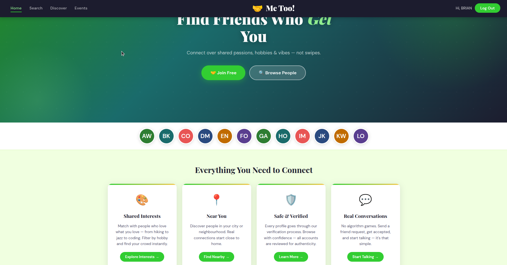
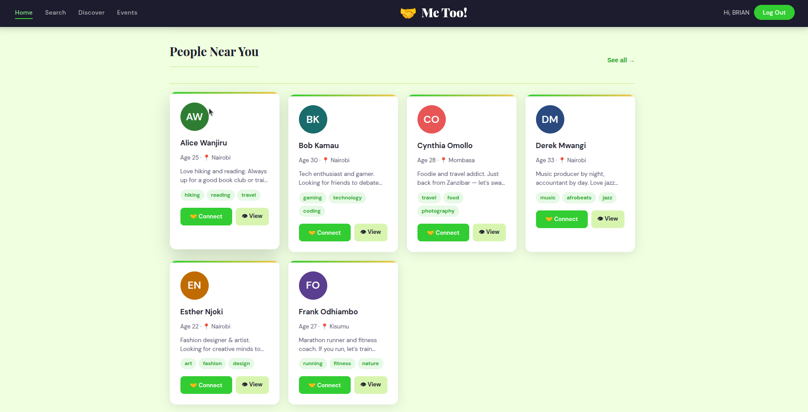
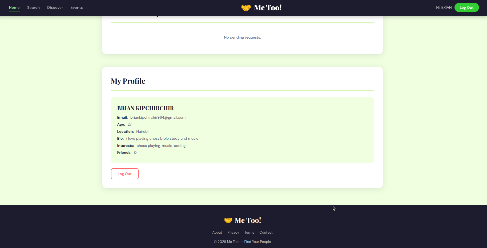
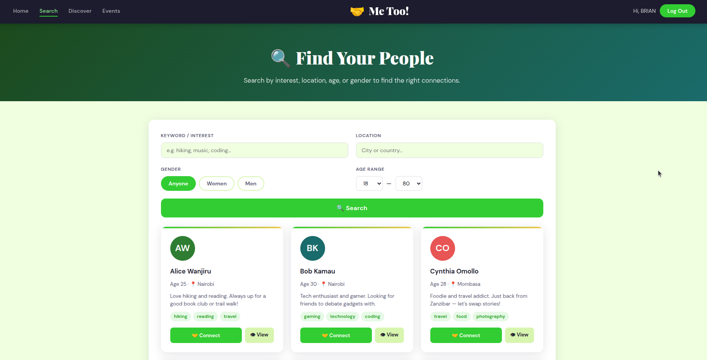

# Me Too! — Find Your People

**Author:** Brian Kipchirchir
**Stack:** React (Vite) · Flask · SQLAlchemy · PostgreSQL · JWT auth (bcrypt-hashed passwords) · Web Push

---

## Overview

Me Too! is a social-discovery app that helps people connect based on **shared interests, hobbies, and location** — not appearance. Browse people near you, search/filter by interest, location, age and gender, discover people by interest category, RSVP to local events, send/accept friend requests, and message your friends directly — with block/report tools and push notifications to back it up.

This is a full-stack rewrite of an earlier vanilla-JS prototype (still available in [`legacy/`](legacy/) for reference). The current app is a two-service architecture:

- **`frontend/`** — a React (Vite) single-page app.
- **`backend/`** — a Flask REST API backed by PostgreSQL via SQLAlchemy, with JWT-based authentication and bcrypt password hashing.

---

## Project Structure

```
Too!/
├── backend/            — Flask API, SQLAlchemy models, migrations, tests
│   ├── app/
│   │   ├── models.py       — User, Interest, FriendRequest, Event, EventRsvp,
│   │   │                     Conversation, Message, Block, Report, PushSubscription
│   │   ├── routes/         — auth, users, friends, events, interests,
│   │   │                     messages, moderation, push blueprints
│   │   ├── emailing.py     — email sending (logs to console; swap in a real
│   │   │                     provider by changing this one module)
│   │   ├── push.py         — Web Push delivery via VAPID
│   │   ├── config.py       — Dev/Test/Prod config (reads from .env)
│   │   └── seed.py         — `flask seed` demo data command
│   ├── generate_vapid_keys.py — one-off script to generate Web Push VAPID keys
│   ├── migrations/      — Alembic migrations (Flask-Migrate)
│   └── tests/           — pytest suite
├── frontend/            — React app (Vite), one page per route
│   └── src/
│       ├── api/            — fetch client + per-resource API calls
│       ├── context/        — Auth / Modal / Toast providers
│       ├── hooks/          — useConnect (friend actions), usePush (Web Push subscribe)
│       ├── components/     — Navbar, cards, modals (login/signup, forgot/reset
│       │                     password, safety/report), AdminReports, etc.
│       ├── pages/          — Home, Search, Discover, Events, Messages, Admin
│       └── sw.js           — service worker for push notifications
├── legacy/              — the original static HTML/CSS/JS prototype
└── docs/screenshots/     — app screenshots
```

---

## Features

| Feature | Details |
|---|---|
| **Auth** | Signup/login with bcrypt-hashed passwords and JWT access tokens; email verification and forgot/reset-password flows (rate-limited); no plaintext passwords, no client-trusted session data |
| **Search** | Server-side filtering by keyword, location, gender, and age range, with pagination |
| **Discover** | Browse by interest category with live counts pulled from the database |
| **Events** | Category filter tabs, RSVP with server-enforced capacity limits and duplicate-RSVP prevention |
| **Friend Requests** | Send, accept, decline; duplicate/self-request prevention; friends derived from accepted requests |
| **Messaging** | Direct messages between friends only; threads with unread tracking; blocked users can't message each other |
| **Safety & Moderation** | Block/unblock users (blocked users are hidden from search and can't interact); report users with a reason, reviewed by admins |
| **Push Notifications** | Optional Web Push (VAPID) for new messages, friend requests, and accepted requests, via a service worker |
| **Avatars** | Upload/delete a profile photo; images are validated, converted, and resized server-side (Pillow) |
| **Admin** | `is_admin`-gated event management (create/edit/delete) and report review at `/admin`, hidden from the nav for regular users |
| **Validation & errors** | Consistent JSON error responses; meaningful 400/401/404/409 statuses instead of silent failures |

---

## Getting Started

### 1. Backend (Flask + PostgreSQL)

```bash
cd backend
python3 -m venv venv
source venv/bin/activate
pip install -r requirements.txt

# create a local Postgres role + database (adjust to your setup)
sudo -u postgres createuser -s "$(whoami)"
sudo -u postgres createdb -O "$(whoami)" metoo_dev

cp .env.example .env      # edit DATABASE_URL / JWT_SECRET_KEY if needed
export FLASK_APP=wsgi.py
flask db upgrade          # create tables
flask seed                # load demo users, interests, and events
flask run                 # http://localhost:5000
```

Run the test suite (uses an in-memory SQLite DB, no Postgres required):

```bash
pytest
```

Web Push notifications are optional — generate a VAPID keypair and drop it into `.env` to enable them:

```bash
python generate_vapid_keys.py   # prints VAPID_PUBLIC_KEY / VAPID_PRIVATE_KEY
```

Without real SMTP credentials configured, verification and password-reset emails are just logged to the console (see `app/emailing.py`) — swap in a real provider there when needed.

### 2. Frontend (React + Vite)

```bash
cd frontend
npm install
cp .env.example .env       # VITE_API_URL, defaults to http://localhost:5000/api
npm run dev                 # http://localhost:5173
```

Open `http://localhost:5173` with the backend running — sign up for a new account, or log in with one of the seeded demo accounts below.

---

## Demo Credentials

Seeded by `flask seed`:

| Name | Email | Password |
|---|---|---|
| Alice Wanjiru | alice@example.com | password123 |
| Bob Kamau | bob@example.com | password123 |
| Cynthia Omollo | cyn@example.com | password123 |
| Derek Mwangi | derek@example.com | password123 |
| Esther Njoki | esther@example.com | password123 |
| Frank Odhiambo | frank@example.com | password123 |
| Scott Martha Awuor | scott@example.com | password123 |
| Brian Kipchirchir (admin) | briankipchirchir964@gmail.com | CHROMETE |

---

## API Overview

All endpoints are prefixed with `/api`. JSON in, JSON out; protected routes expect `Authorization: Bearer <token>`.

- **Auth** — `POST /auth/signup`, `POST /auth/login`, `GET /auth/me`, `POST /auth/verify-email`, `POST /auth/resend-verification`, `POST /auth/forgot-password`, `POST /auth/reset-password`
- **Users** — `GET /users?q=&location=&gender=&min_age=&max_age=&interest=&page=&per_page=`, `GET /users/<id>`, `POST /users/me/avatar`, `DELETE /users/me/avatar`
- **Interests** — `GET /interests`
- **Friends** — `POST /friends/requests`, `GET /friends/requests`, `POST /friends/requests/<id>/accept`, `POST /friends/requests/<id>/decline`, `GET /friends`
- **Messages** (friends only) — `GET /messages/threads`, `GET /messages/threads/<other_id>`, `POST /messages/threads/<other_id>`
- **Moderation** — `POST /moderation/users/<id>/block`, `DELETE /moderation/users/<id>/block`, `GET /moderation/users/blocked`, `POST /moderation/users/<id>/report`
- **Push** — `GET /push/vapid-public-key`, `POST /push/subscribe`, `POST /push/unsubscribe`
- **Events** — `GET /events?category=`, `POST /events/<id>/rsvp`, `DELETE /events/<id>/rsvp`
- **Admin-only** (`is_admin` account required) — `POST /events`, `PATCH /events/<id>`, `DELETE /events/<id>`, `GET /moderation/admin/reports?status=`, `PATCH /moderation/admin/reports/<id>`

---

## Screenshots






*(from the earlier prototype UI — the React rebuild keeps the same look and feel)*

## License

MIT — see [LICENSE](LICENSE). Open for learning and personal use.
